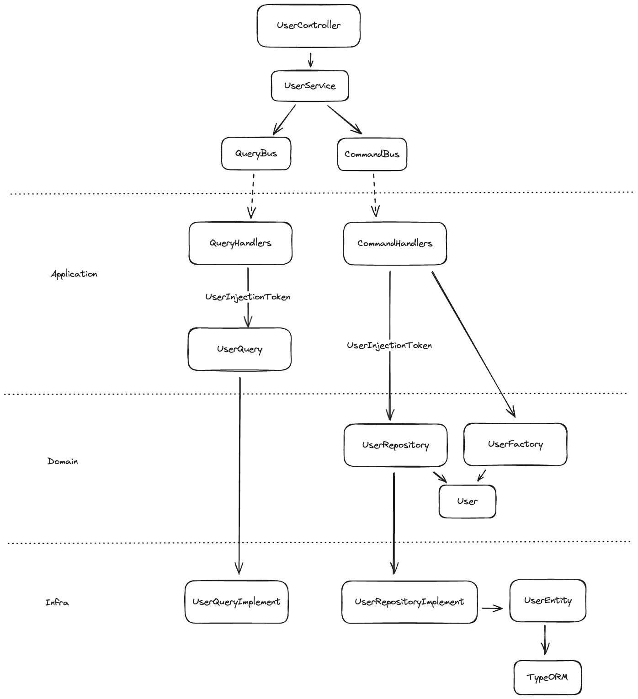

## Concepts

- DDD: Domain Driven Development ou Conception pilotée par le domaine. Technique consistant à concevoir le développement en séparant le domaine métier des considérations techniques propres à l'implémentation.
- CQRS: Command Query Responsability Segregation. Patron de conception qui sépare la partie lecture et la partie écriture afin de limiter le couplage des fonctionnalités et les effets de bords.
- NestJS: Framework orienté back-end écrit en TypeScript, inspiré de l'architecture d'Angular.

## Motivations

La séparation du domaine permet de rassembler les règles métiers au même endroit et d'implémenter des tests automatisés centrés sur ces règles sans considération des contraintes purement techniques (ex: la base de données).

La séparation lecture/écriture permet de limiter les responsabilités des chaque `handler`. Le patern évite, par exemple, toute tentation d'écrire de la donnée transformée lors de la lecture.

Opinion personnelle: je trouve le mécanisme `Query/Command -> Bus -> Handler -> Event -> EventHandler` plutôt élégant dans la séparation des responsabilités.

## Dossiers & fichiers

Pour cette application du DDD x CQRS avec NestJS, on utilise :

- Le `Service` et `Controller` proposé par la doc officielle NestJS. Le `Controller` dépend du `Service`. Le `Service` expose les fonctions qui lanceront les `Query` et `Command`.
- le dossier `domain` défini notre domaine.
  - Le modèle `User` étend la classe `AggregateRoot` du module `nestjs/cqrs`.
  - L'interface `UserRepository`
  - La classe `UserFactory` qui permet de créer un nouvel `User`
- le dossier `application` défini les `Query` & `Command`, leurs `handlers`
  - L'interface `UserQuery` défini les fonctions d'extraction
- le dossier `infrastructure` contient les implémentations de `UserRepository` et `UserQuery` en faisant le lien vers `typeORM`
- l'injection des implémentation se fait dans le `UserModule` via l'injection de `Provider[]` de Nest JS

## Exemple: User Module

### Schéma



### Déclaration

```
// Déclaration des implémentations qui seront injectée par Nest dans les classes application
const infrastructure: Provider[] = [
  {
    provide: UserInjectionToken.USER_REPOSITORY,
    useClass: UserRepositoryImplement,
  },
  {
    provide: UserInjectionToken.USER_QUERY,
    useClass: UserQueryImplement,
  },
]
const domain = [UserFactory]
const application = [
  FindUserByIdHandler,
  FindUserByEmailHandler,
  CreateUserHandler,
]

@Module({
  imports: [CqrsModule, PasswordModule],
  providers: [...infrastructure, ...domain, ...application, UserService],
  exports: [UserService],
  controllers: [UserController],
})
export class UserModule {}
```
